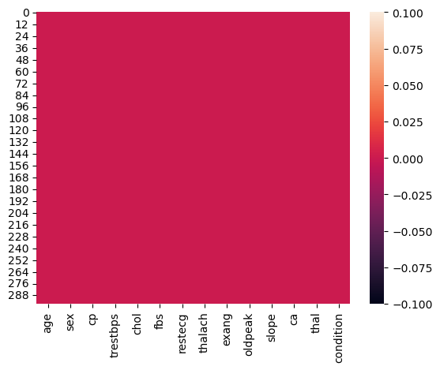
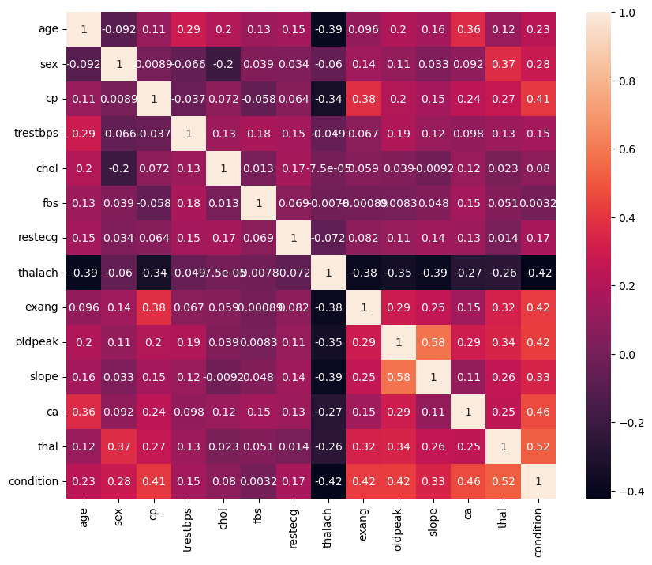
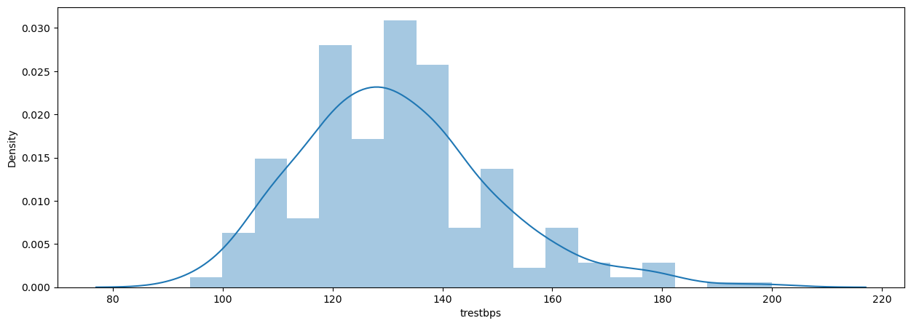
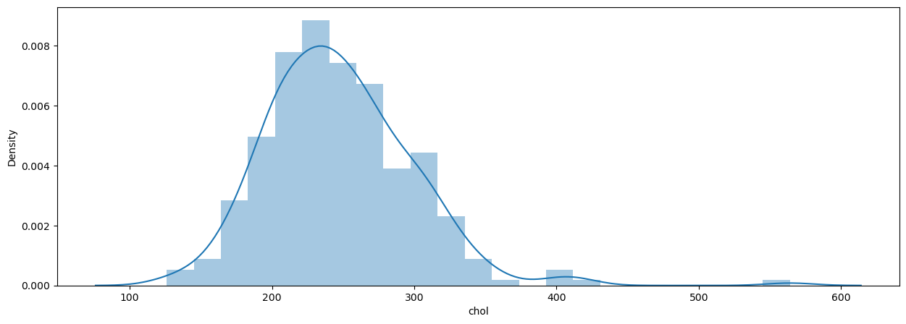

# Laporan Proyek Machine Learning
### Nama : Putri Rezita Amelia
### Nim : 211351114
### Kelas : Pagi B

## Domain Proyek

Penyakit jantung adalah salah satu penyakit yang paling mematikan di seluruh dunia, yang menyebabkan ribuan kematian setiap tahun. Penyakit jantung dapat memiliki gejala awal yang tidak terdeteksi, dan seringkali pasien menyadari kondisinya terlambat, ketika penyakit sudah mencapai tahap yang lebih serius. Oleh karena itu, deteksi dini dan pencegahan penyakit jantung sangat penting untuk meningkatkan harapan hidup dan kualitas hidup pasien.

Di era digital dan teknologi informasi saat ini, penggunaan aplikasi kesehatan menjadi semakin umum. Aplikasi pendeteksi penyakit jantung menjadi salah satu alat yang sangat berguna untuk membantu individu memantau kesehatan jantung mereka sendiri dengan lebih mudah dan efisien

**Rubrik/Kriteria Tambahan (Opsional)**:
- Aplikasi ini dirancang untuk membantu individu mendeteksi potensi risiko penyakit jantung sejak dini. Dengan memasukkan data medis dan gaya hidup, aplikasi dapat memberikan prediksi awal tentang risiko seseorang terkena penyakit jantung
- Penyakit Jantung Koroner (PJK) masih merupakan penyebab kematian dan kesakitan utama yang
berdampak secara sosioekonomi seperti juga stroke. Penyakit ini dapat dicegah dengan deteksi dini
dan pengendalian faktor risiko.
  
  Format Referensi: [Faktor Risiko Dominan Penyakit Jantung Koroner di Indonesia](https://www.researchgate.net/profile/Made-Dewi-Susilawati-2/publication/312270191_Faktor_Risiko_Dominan_Penyakit_Jantung_Koroner_di_Indonesia/links/5ee2c6ae299bf1faac4e610a/Faktor-Risiko-Dominan-Penyakit-Jantung-Koroner-di-Indonesia.pdf) 

## Business Understanding

Berdasarkan sumber masalah saya membuat klasifikasi masalah ini berdasarkan Sumber masalah yaitu :
- Masalah manusia : Pasien yang mungkin memiliki gejala penyakit jantung
- Masalah Teknis : Fungsi dan akurasi algoritma atau perangkat lunak pendeteksi penyakit jantung

Bagian laporan ini mencakup:

### Problem Statements

Rumusan Masalah :
- Kita seringkali lalai mengenai kondisi kesehatan kita
- Mahal dan Rumitnya pengecekan kesehatan secara berkala

### Goals

Menjelaskan tujuan dari pernyataan masalah:
- Deteksi dini dengan cara dilakukan pengecekan kesehatan secara berkala agar kita bisa mencegah penyakit yang menjangkit pada tubuh kita
- Membuat aplikasi pendeteksi penyakit jantung yang mudah, murah dan bisa diakses dimana saja selama kita bisa terkoneksi dengan internet

## Data Understanding
Saya menggunakan datasets dari kaggle yang memiliki judul Heart Disease Cleveland UCI datasets ini berisi tentang rekam medis banyak orang yang berada di Cleveland , Amerika Serikat mengenai penyakit jantung, datasets ini juga memiliki 13 atribut.<br> 

Contoh: [Heart Disease Cleveland UCI](https://www.kaggle.com/datasets/cherngs/heart-disease-cleveland-uci).

Selanjutnya terdapat 13 variabel atau fitur pada data. Sebagai berikut:  

### Variabel-variabel pada Heart Disease Cleveland UCI Dataset adalah sebagai berikut:
- Age : merupakan umur pasien dalam satuan tahun. (int64)
- Sex : merupakan jenis kelamin pasien meliputi [1: Male, 0: Female]. (binary)
- CP : merupakan jenis nyeri dada yang dialami pasien [0: tidak mengalami nyeri dada (stabil), 1: nyeri dada yang halus (hampir tidak terasa) 2: nyeri dada nonkardiak 3: nyeri dada akibat jantung koroner]. (int64)
- trestbps : Tekanan darah dalam mm Hg (int64)
- chol : kandungan kolestrol dalam mg/dl (int64)
- fbs : Gula darah lebih dari 120mg/dl [1: true, 0: false] (binary)
- restecg : hasil dari elektro cardiograpic (int64)
- thalach : detak jantung maksimum (int64)
- exang : induksi angina [1: True 0: False] (binary)
- oldpeak : tingkat depresi 
- slope : kemiringan puncak latihan segmen ST (int64)
- ca : pembuluh darah jantung 0-3 (int64)
- thal : 0 = normal, 1 = cacat tetap, 2 = cacat yang dapat dibalik (int64)
- condition : 0 = tidak terjangkit 1 = terjangkit


## Data Preparation
Pertama kita harus import library yang dibutuhkan dengan
``` bash
import numpy as np
import pandas as pd
import matplotlib.pyplot as plt
import seaborn as sns
from sklearn.model_selection import train_test_split
from sklearn.linear_model import LogisticRegression
from sklearn.metrics import accuracy_score
```
Kemudian kita import data sav kedalam kode program dengan membuat variable dataset kemudian menampilkan 5 data pada awal file
``` bash
dataset = pd.read_csv("heart_cleveland_upload.csv")
dataset.head()
```
untuk mengetahui tipe data dan terdapat atribut apa saja dalam dataset
``` bash
dataset.info()
```
untuk melihat jumlah data, rata - rata, standar, nilai minimal, nilai 25%, nilai 50%, nilai 75%, nilai maksimum dari dataset
``` bash
dataset.describe()
```
untuk melihat apakah ada data yang tidak terisi (null) dengan grapik heatmap
``` bash
sns.heatmap(dataset.isnull())
```
<br>
untuk menampilkan grapik dalam heatmap yang mengukur sejauh mana variabel-variabel dalam dataset berkaitan satu sama lain
``` bash
plt.figure(figsize=(10,8))
sns.heatmap(dataset.corr(), annot=True)
```
<br>
untuk membuat plot distribusi (distribution plot) dari variabel 'trestbps' dalam dataset
``` bash
plt.figure(figsize=(15,5))
sns.distplot(dataset['trestbps'])
```
<br>
untuk membuat plot distribusi dari variabel kalori yang terdapat di dataset
``` bash
plt.figure(figsize=(15,5))
sns.distplot(dataset['chol'])
```
<br>
untuk mengelompokan data detak jantung maksimum sebagai kunci
``` bash
models = dataset.groupby('thalach').count()[['age']].sort_values(by='age',ascending=True).reset_index()
models = models.rename(columns={'age':'age'})
```
menunjukan bar plot detak jantung maksimum
``` bash
fig= plt.figure(figsize=(15,5))
sns.barplot(x=models['thalach'], y=models['age'], color='royalblue')
plt.xticks(rotation=60)
```
<br>

**Rubrik/Kriteria Tambahan (Opsional)**: 
- Menjelaskan proses data preparation yang dilakukan
- Menjelaskan alasan mengapa diperlukan tahapan data preparation tersebut.

## Modeling

### Seleksi Variable Bebas dan Label

yang menjadi variable bebas disini kita deklarasikan sebagai x yang berisi semua atribut pada dataset kecuali condition dikarenakan condition akan dijadikan sebagai label (output)
``` bash
x = dataset.drop(columns='condition', axis=1)
y = dataset['condition']
```
### Split Data

lalu saya akan memisahkan data yang akan di train dan di test sebesar 20%
``` bash
x_train, x_test, y_train, y_test = train_test_split(x, y, test_size=0.2, stratify=y, random_state=2)
```

### Model Regresi Logistik
saya menggunakan model regresi logistik lalu menyesuaikan metode dengan data yang akan di train
``` bash
model = LogisticRegression()
model.fit(x_train, y_train)
```

## Evaluation
Untuk menunjukan seberapa presisi algoritma yang sudah kita bangun maka kita bisa melihat berapa skor yang kita dapatkan dari data training dan data testing

berikut adalah skor akurasi data training yang kita dapatkan adalah sekitar 85%
``` bash
x_train_predict = model.predict(x_train)
training_data_accuracy = accuracy_score(x_train_predict, y_train)
print('Akurasi data training dengan model logistic regression adalah =',training_data_accuracy)
```
kemudian untuk skor data testing kita bisa tampilkan dengan membuat variable baru dan menampilkannya dan yang kita dapatkan adalah 90%
``` bash
x_test_predict = model.predict(x_test)
testing_data_accuracy = accuracy_score(x_test_predict, y_test)
print('Akurasi data testing menggunakan model logistic regression adalah =', testing_data_accuracy)
```
lalu kemudian kita coba inputkan data dengan tujuan mengetest apakah algoritma yang sudah kita bangun berjalan dengan seharusnya
``` bash
input_data =(61, 1, 0, 134, 234, 0, 0, 145, 0, 2.6, 1, 2, 0)
dataasarray = np.asarray(input_data)
reshape = dataasarray.reshape(1, -1)
prediction = model.predict(reshape)
print(prediction)

if(prediction[0]==0):
    print('Pasien Tidak Terkena Penyakit Jantung')
else:
    print('Pasien Terkena Penyakit Jantung')
```

## Deployment
pada bagian ini saya telah upload di streamlit share :
Link Aplikasi : [Prediksi Penyakit Jantung](https://tugasuts-g9qvqbuxcjcsnenleq94db.streamlit.app/).
